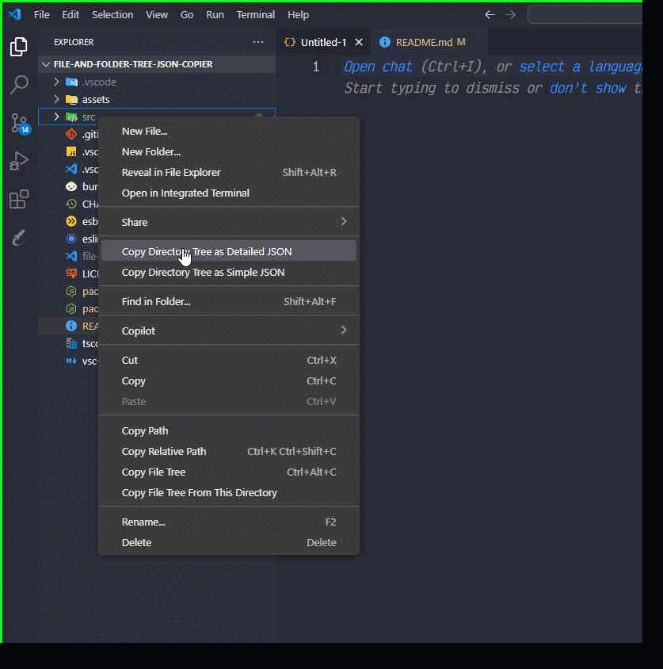

# 📁✨ File and Folder Tree JSON Copier ✨📁


**Easily copy your project's directory tree in `JSON` format — simple or detailed!**  
📦 Super useful for documentation, backups, debugging, and developer tools.

[](https://marketplace.visualstudio.com/items?itemName=AmirMaghami.file-and-folder-tree-json-copier)
[](https://github.com/amirrr1987/file-and-folder-tree-json-copier/blob/main/LICENSE)
[](https://github.com/amirrr1987/file-and-folder-tree-json-copier/stargazers)

---

## 🚀 Features

- 🧾 **Simple JSON Mode** — Just folder & file names.
- 🧠 **Detailed JSON Mode** — Includes:
  - 📏 Size, 📄 Extension, 🕒 Timestamps
  - 🔐 Permissions, 🔁 Symlink Status
  - 💬 Language Detection, 🧬 File Hash
  - 🔍 Git Info (Author, Date, Commit)
  - 📊 Line/Word/Code Stats
- 🎛️ **Selective Field Export** — Choose exactly what you want
- 🖱️ **Right-click Context Menu** — Super fast usage

---

## 🎬 Demo

> Here’s how it works in action:

<p align="center">
  
</p>

---

## 📸 Screenshots

> _Add your own screenshots in the `assets/` folder and update these links._

| Simple Mode | Detailed Mode |
|-------------|---------------|
|  |  |

---

## ⚙️ Usage

Right-click on any **file or folder** in VS Code Explorer:

- 🔹 **Copy Directory Tree as Simple JSON**
- 🔸 **Copy Directory Tree as Detailed JSON**

Paste anywhere you want — 💥 instant structure dump.

---

## 📦 Installation

Search for this extension in the marketplace:

```

File and Folder Tree JSON Copier

````

Or install it directly from [Visual Studio Marketplace](https://marketplace.visualstudio.com/items?itemName=AmirMaghami.file-and-folder-tree-json-copier).

---

## 🧠 Pro Mode (Coming Soon)

- ✅ Export JSON to a file  
- ✅ Preview before copying  
- ✅ Support for `.gitignore` and custom ignore patterns  
- ✅ Select fields with a user interface  
- ✅ Toggle hash type (MD5, SHA256)  
- ✅ File type classification (text, binary, code)

---

## 📂 Project Structure

```bash
src/
├── constants.ts
├── types.ts
├── utils/
│   ├── fileUtils.ts
│   ├── gitUtils.ts
│   ├── codeStats.ts
│   └── jsonBuilder.ts
├── commands/
│   ├── generateSimple.ts
│   └── generateDetailed.ts
├── ui/
│   └── fieldSelection.ts
└── extension.ts
````

---

## 🛠️ Development

```bash
# Install dependencies
npm install

# Compile once
npm run compile

# Watch for file changes
npm run watch
```

---

## 🙌 Contributing

Issues, ideas, and pull requests are welcome!
⭐️ Star the project if you like it and want to support more features.

---

## 📄 License

[MIT](LICENSE) © [Amir Maghami](https://github.com/amirrr1987)

---

<p align="center">
Made with ❤️ and ☕ in TypeScript
</p>


